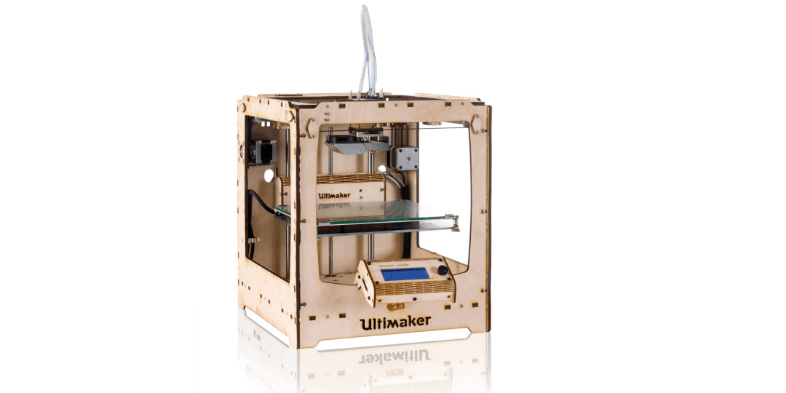

# 👋 Знакомство с лазером


**Лазерная резка** является самым простым и быстрым способом знакомства с миром цифрового производства. С помощью этой операции можно быстро изготовить оригинальный сувенир или подготовить комплект деталей для сборки функционального изделия&#x20;


## Зачем этот курс

В рамках этого курса вы:

* познакомитесь с основными видами машин, применяющихся для разделения и маркировки материалов с помощью лазерного излучения, их возможностями и ограничениями;
* освоите основные приемы подготовки заданий для машины лазерной резки и маркировки для изготовления плоских деталей простого и сложного контура;
* изучите правила безопасной работы с опасной машиной;
* научитесь самостоятельно проектировать и изготавливать с помощью лазерной резки детали для своих проектов.

<figure><figcaption>
3D принтер Ultimaker в 2011 году по праву считался самым быстрым в своем классе. Большинство деталей принтера, включая шестерни редуктора экструдера, изготавливались лазерной резкой фанеры.   Источник: <a href="https://ultimaker.com/learn/three-reasons-for-open-source-tech-in-your-3d-printing-classroom/">https://ultimaker.com/learn/three-reasons-for-open-source-tech-in-your-3d-printing-classroom/</a>
</figcaption></figure>

