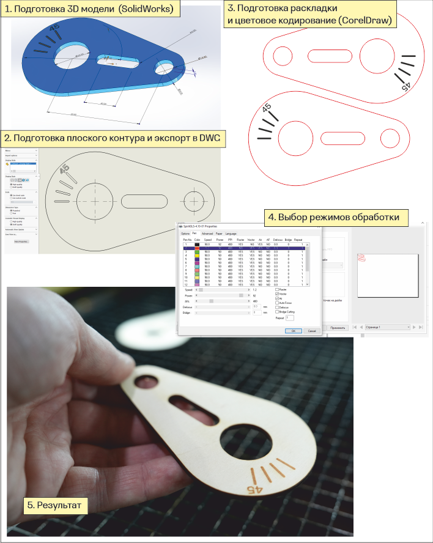

# CAD/CAM/CNC

Как и любая цифровая производственная система, лазерная резка существует внутри цепочки CAD/CAM/CNC. В CAD системе создается модель будущего изделия, в CAM системе — управляющая программа для перемещения рабочего органа и активации лазерного источника и, наконец, CNC контроллер машины обрабатывает управляющую программу и обеспечивает работу машины в соответствии с программой.&#x20;

Машины лазерной резки и маркировки с CO2 газоразрядными лазерами мощностью до 100 Вт получили широкое распространение благодаря их применению на рынке производства элементов наружной рекламы, сувенирной продукции, различных знаков и вывесок. Производители машин (американские Epilog и Universal, австрийский Trotec, тайваньский GCC) старались делать их максимально доступными и понятными не инженерам-технологам, а графическим дизайнерами и полиграфистам. Соответственно, в качестве CAD системы для машин лазерной резки может выступать графический редактор CorelDRAW или Adobe Ilustrator, CNC контроллер обеспечивает все необходимое, но дает очень ограниченные возможности для оператора по настройкам машины и процесса, и, наконец, CAM система имитирует драйвер принтера.  Для человека, привыкшего к работе, например, с фрезерными станками с ЧПУ, такая система, в которой скорость обработки задается не в мм/с, а в процентах, стратегия обработки выбирается исходя из толщины линии, а режим обработки задается через цвет линии, может показаться странной и неудобной. Человеку же не обремененному лишним опытом общения с классическим CAD/CAM/CNC такая система может показаться вполне логичной. В любом случае, освоить систему достаточно просто, нужно только быть внимательным и аккуратным. Как бы аппарат не изображал из себя принтер, он остается гораздо более коварным и опасным устройством, способным на несоизмеримо большие неприятности, чем зажеванный лист А4 или потерянное в тоннелях WPS задание.&#x20;

Простейший маршрут подготовки задания для лазерной резки с помощью GCC Spirit состоит из двух этапов:&#x20;

1. в CorelDraw создаются контуры;
2. в CAM системе задаются режимы и параметры обработки.

Более длинный, но при сложной геометрии более удобный маршрут:

1. в наиболее подходящей для конкретной задачи CAD системе создается модель;
2. если модель 3-х мерная, то для нее готовится плоская проекция в масштабе 1:1 и экспортируется, например, в DWG формат;
3. DWG файл импортируется в CorelDRAW, корректируются толщины линий и цвета, если необходимо изготовить несколько деталей, то готовится раскладка;
4. в CAM системе адаются режимы и параметры обработки.

<figure><figcaption></figcaption></figure>

&#x20;   &#x20;
