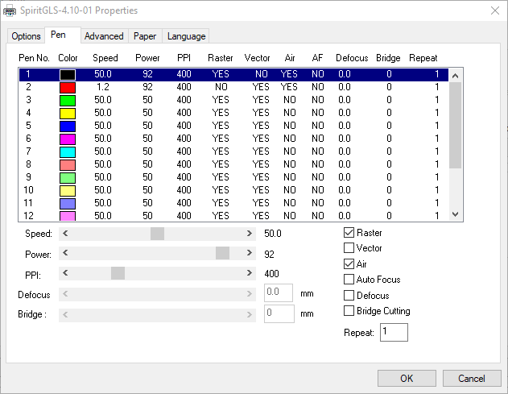
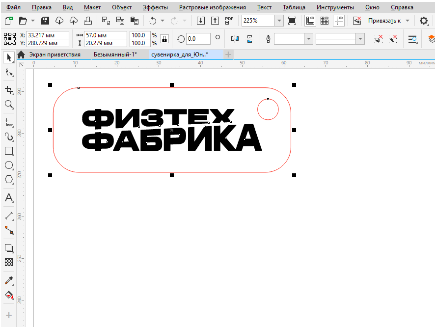

# Цветовое кодирование режимов

Модель для лазерной резки проще всего подготовить в среде графического редактора CorelDraw. В редактор можно импортировать готовые контуры (.dxf, .dwg, .eps, .svg и прочие форматы) или подготовить контуры для резки и изображения для растровой обработки непосредственно в редакторе. &#x20;

В одном задании, отправляемом на машину, можно совместить несколько разных операций, выполняемых по разным режимам. Для определения, какому графическому элементу соответствуют какой режим, используются цвета в модели RGB. CAM система GCC обрабатывает цвета в следующей последовательности: черный, красный, зеленый и так далее, см. снимок окна.

<figure><figcaption>
Цветовая дифференциация режимов: в этом примере черный настроен на маркировку, красный — на резку 
</figcaption></figure>

Наиболее распространенный сценарий — использование черного (первого) цвета для графических элементов, предназначенных для растровой обработки, а красного (второго) цвета — для резки. Таким образом сначала будут выжигаться текст и символы, а потом детали будут вырезаться по контуру.

<figure><figcaption>
Файл задания
</figcaption></figure>

\

<figure><figcaption>
Выполнение задания
</figcaption></figure>

