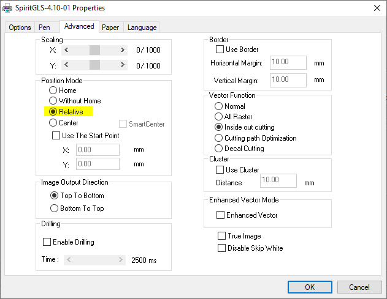
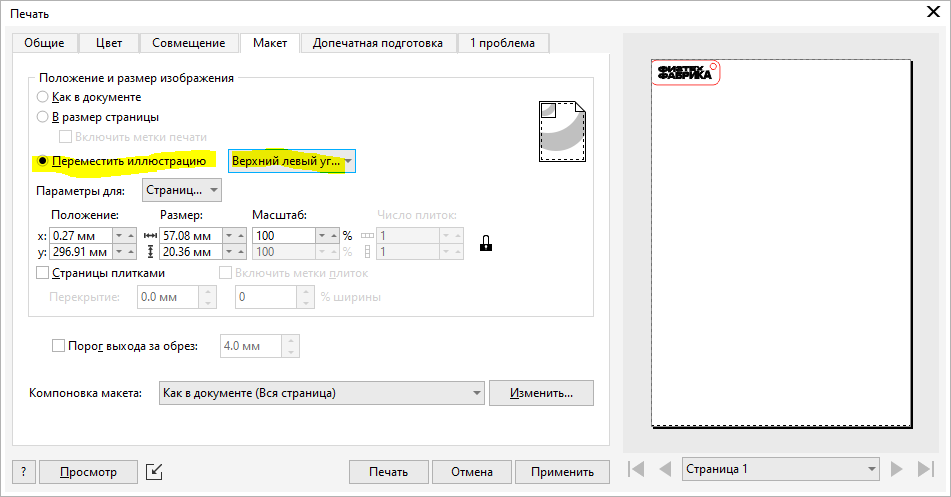
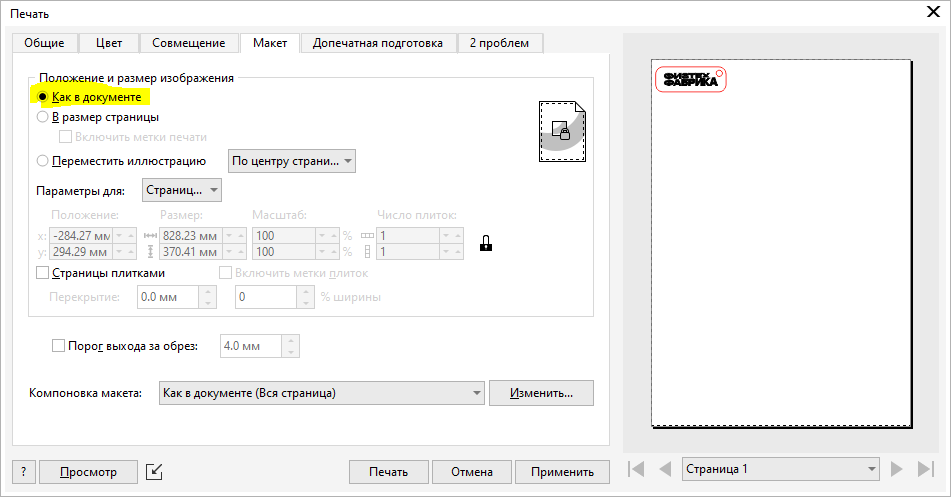

# Начало координат

После того, как модель, представляющая собой комбинацию векторных и растровых элементов,  готова, то есть после того, как  каждому из элементов модели присвоен определенный цвет, кодирующий режим обработки, необходимо установить привязку к системе координат машины. Это необходимо, чтобы задание было выполнено в том месте на заготовке, где мы этого ожидаем.

Как и практически любая цифровая производственная машина, GCC Spirit имеет свой абсолютный ноль, служащий началом отсчета в машинной системе координат. Этот ноль машина каждый раз определяет в процессе инициализации после включения: головка едет слева направо и по направлению к стоящему перед машиной оператору до срабатывания концевых датчиков. При подготовке заданий мы можем привязываться к машинному нулю, но, как и в случае с большинством цифровых машин, это не удобно. Вместо абсолютного ноля или начала координат машины, гораздо удобнее использовать ноль относительный, или начало координат, привязанное к заготовке. При этом нам достаточно руками переместить лазерную головку в то место в рабочей зоне, где мы видим наш относительный ноль и удостовериться в том, что в системе активирована относительная система координат.&#x20;

<figure><figcaption>
Relative position mode — отнорсительная система координат
</figcaption></figure>

Аккуратно разместить головку, например, над углом заготовки нам помогает вспомогательный красный лазер, луч которого идет по тому же оптическому тракту, что и основной луч. Положение видимой красной точки — относительное начало координат. &#x20;

Следующий шаг — привязать геометрию нашего задания к относительному нулю. Для этого есть несколько путей и мы рассмотрим два из них, наиболее удобных и часто используемых.

### Перемещение задания

Разместив все графические элементы друг относительно друга на листе в Corel Draw мы вызываем окно настроек печати (Crtl+P или меню: файл/печать…). На вкладке “**макет**” выбираем “**переместить иллюстрацию**” в “**верхний левый угол”**.&#x20;

<figure><figcaption></figcaption></figure>

Если смотреть на экран компьютера, то координатные оси у нас направлены слева направо (X) и сверху вниз (Y), соответственно, все элементы нашего задания, не смещаясь друг относительно друга, перемещаются к началу координат так, что самая левая точка в задании (точка с наименьшим значением по X) перемещается в ноль по X, а самая верхняя (точка с наименьшим значением по Y) — в ноль по Y.&#x20;

При таком способе привязки координат нужно чтобы красная точка вспомогательного лазера была хоть немного смещена вниз и вправо относительно верхнего левого угла заготовки. На всякий случай, верх и низ на горизонтальном столе машины — это дальняя и ближняя относительно стоящего перед машиной оператора границы рабочего стола.

Таким способом привязки удобно работать и с новыми заготовками (перемещаем красную точку поближе к левому верхнему углу) и с заготовками, из которых какие-то детали уже были вырезаны (перемещаем красную точку к верхней и левой границе подходящей области на заготовке.&#x20;

### Использование “листа” в Corel Draw &#x20;

Другой способ, иногда более удобный — использование верхнего левого угла листа в CorelDraw, как начала координат. При этом при подготовке задания мы не просто размещаем контуры друг относительно друга, но и размещаем их относительно границ листа. При подготовки “печати”, на вкладке “**макет**” выбираем “**как в документе**”.

<figure><figcaption></figcaption></figure>

Левая и верхняя граница нашего задания будет смещена от красной точки, ровно настолько, насколько изображение отстоит от левого верхнего угла виртуального листа в CorelDraw.


Данный способ корректно работает только если в CAM и в макете CorelDraw используются одинаковые размеры “листа”. Лист в CAM задается на вкладке Paper



Если у нас совпадают не только размеры листа в CAM и CorelDraw, но и размеры реальной заготовки, то мы получаем возможность идеально разложить все детали и максимально использовать материал

