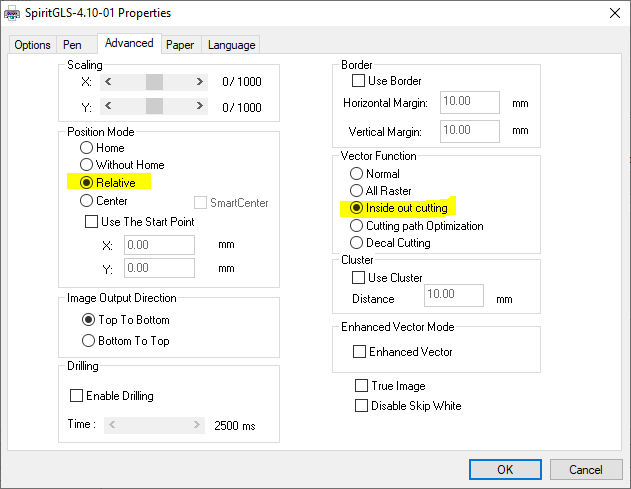
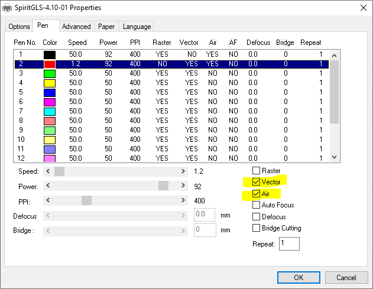

# Отправка задания

Перед отправкой задания необходимо настроить основные параметры работы системы. На вкладке Options необходимо выбрать режим Manual Color Fill. Если наше задание включает в себя построчную (растровую) обработку, то нужно выбрать желаемое разрешение обработки — DPI. DPI или dots per inch (точки на дюйм) — стандартный в полиграфии способ задания разрешения печати. В случае с лазерной маркировкой DPI это еще и LPI — lines per inch, то есть количество строк (смещений по оси Y), приходящихся на каждый дюйм изображения по вертикали. Повышение разрешения пропорционально увеличивает время обработки задания.

<figure><figcaption></figcaption></figure>

На вкладке Advanced необходимо удостовериться в том, что в разделе Position Mode выбран пункт Relative (относительная система координат). В разделе Vector Function должен быть выбран пункт Inside out cutting. Таким образом будут отрабатываться сначала внутренние контуры, а потом внешние.  Это позволит не допустить ситуацию, когда в уже вырезанной и потому сместившейся относительно начала координат и фокальной плоскости детали будут вырезаться дополнительные отверстия. Важно понимать, что такая сортировка возможна только применительно к замкнутым контурам.

<figure><figcaption></figcaption></figure>

На вкладке Pen для каждого из используемых цветов необходимо установить режим обработки: значение скорости и мощности. Кроме этого, всегда должна быть активирована опция Air — это команда для машины на включения компрессора и подачу сжатого воздуха в зону резания. Также обратите внимание на опции Raster и Vector, присваемые каждому из цветов. Если, например, в задании будут тонкие и толстые линии черного цвета и для черного цвета будут активированы опции Raster и Vector, то машина сначала в построчном режиме обработает толстые линии, а потом — в контурном режиме пройдет по тонким. Если галочка напротив Vector будет отсутствовать, то все тонкие линии будут проигнорированы и машина проведет только построчную обработку толстых линий. Если будет активирован только Vector, то машина проигнорирует часть задания с толстыми линиями и проведет только контурную обработку тонких линий. Наконец, если и Vector и Raster будут отключены, то машина полностью проигнорирует данный цвет.&#x20;

Хорошая практика — активировать только Raster для цвета, кодирующего задания на маркировку и активировать только Vector для цвета, кодирующего задания для резки. При таком подходе если в модели случайно окажутся толстые линии в задании на резку или тонкие в задании на маркировку, то они будут проигнорированы.&#x20;

<figure><figcaption></figcaption></figure>

После присвоения всех необходимых атрибутов и значений параметров обработки, командой Print задание отправляется на машину.
