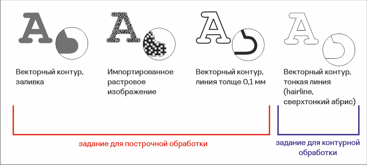

# Вектор и растр

Исходной информацией для CAM системы лазерной машины GCC служат 2D графические модели, как в векторном, так и в растровом формате. Векторный контур используется как путь для контурной обработки (одновременное перемещение головки по осям X и Y). Растровое изображение, соответственно, используется как основа для программы построчной обработки. Напомним, преимущественно контурная обработка используется для задач резки, а построчная — для задач маркировки.

В качестве программы для подготовки заданий для машины GCC удобно использовать пакет CorelDRAW, причем данный графический редактор может использоваться и для создания новых моделей и для упаковки ранее подготовленных в других программах.&#x20;

Важной особенностью CAD/CAM/CNC системы, основанной на машине GCC Spirit и использующей CorelDRAW в качестве CAD, является не совсем обычная интерпретация векторных изображений. Любой растровой рисунок или фотография, импортированная в CorelDRAW однозначно будет восприниматься CAM системой, как основа для генерации траектории построчной обработки. Однако только векторные контуры, представленные тончайшими линиями (hairline, сверхтонкий абрис), будут восприниматься, как основа, для прокладки маршрута контурных перемещений головки. Любые векторные изображения, состоящие из линий шире чем “сверхтонкий абрис” будут растрироваться и станут основой для построчной обработки.

<figure><figcaption></figcaption></figure>

Иными словами, при подготовке заданий для GCC Spirit, растровое изображение — это “растр”, векторные контуры с линиями произвольной толщины — это “растр”, и только тончайшие линии векторных контуров — это “вектор”. &#x20;
