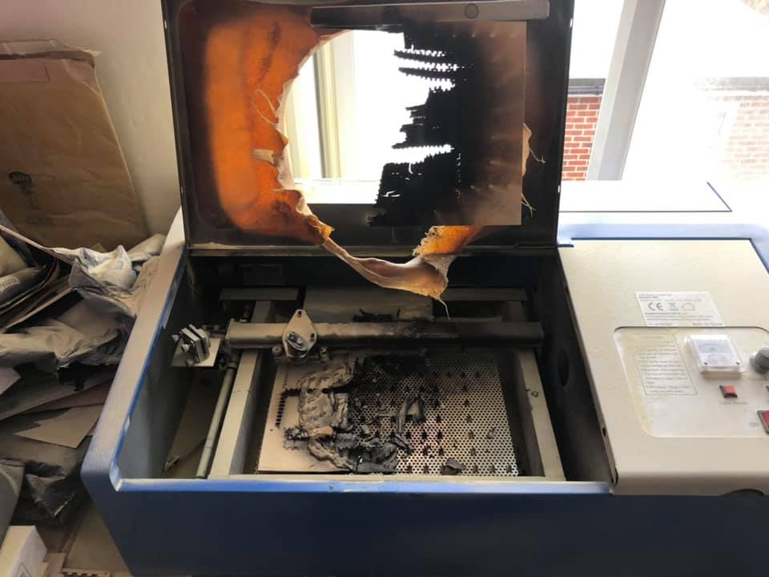

# ☠ Безопасность превыше всего


Машина CO2 лазерной резки несет в себе очевидные и не очень очевидные угрозы. Работа с данной машиной — ответственное занятие, требующее понимания и соблюдения правил, концентрации внимания и аккуратности



Запрещается использовать машину лазерной резки без согласования с сотрудником Фабрики и в отсутствие такового в помещении №21


## Факторы потенциального  вредного воздействия

#### Лазерное излучение

Машина лазерной резки оснащена мощным источником лазерного излучения и **лазерное излучение** мы обязаны задекларировать как главный опасный фактор. Попадание прямого или отраженного лазерного луча на кожу неизбежно приведет к ожогу, попадание прямого или отраженного луча в глаза — к тяжелым и необратимым травмам.&#x20;

К счастью, в процессе штатной эксплуатации машины лазерной резки воздействие лазерного луча на человека исключается и учет настоящего фактора вредного воздействия сводится к категорическому недопущению **нештатной** эксплуатации машины.


**Категорически запрещается** вести обработку с открытой крышкой или кожухами. Крышка машины открывается исключительно для установки заготовки до начала обработки и извлечения деталей и остатков материала после завершения обработки.&#x20;

Кожуха машины снимаются исключительно для ее обслуживания квалифицированным персоналом


#### Поражение электрическим током

Как и любой электроприбор, машина лазерной резки несет в себе риски поражения электрическим током.


Не допускается эксплуатация установки при при малейших подозрениях на **неисправность электрической проводки** или розетки, к которой она подключена



Не допускается работа с установкой мокрыми руками


#### Отравление ядовитыми веществами

При обработке материалов на машине лазерной резки образуются продукты горения — газы и аэрозоли, в том числе токсичные. Для предотвращения вредного воздействия токсичных веществ необходимо соблюдение следующих правил.


Перед запуском процесса лазерной резки необходимо включить вытяжную систему&#x20;



Не допускается использовать запрещенные для обработки на лазерной машине материалы! Полный перечень разрешенных и запрещенных материалов приводится в следующем разделе



Не открывайте крышку лазерной машины сразу после завершения задания, подождите 20 – 30 секунд — дайте время вытяжной системе забрать продукты горения


#### Открытое пламя

Увы, машина лазерной резки может стать источником возгорания. Ответственная правильная эксплуатация машины снижает риски возникновения пожара, но полностью их не исключает, поэтому:&#x20;


прежде чем начать работу с машиной лазерной резки найди глазами огнетушитель!


Причиной возгорания может стать обработка легковоспламеняющегося материала, поэтому повторим правило из предыдущего раздела:


Не допускается использовать запрещенные для обработки на лазерной машине материалы! Полный перечень разрешенных и запрещенных материалов приводится в следующем разделе


Еще одной причиной пожара может стать мусор (остатки материала от предыдущих операций), скопившийся под сотовым столом, поэтому:


Перед началом работы убедись в отсутствии посторонних предметов и мусора на рабочем столе машины и под ним.&#x20;

После окончания работы убери со стола и из под стола посторонние предметы и мусор&#x20;


&#x20;Другой причиной возгорания может стать неправильно подобранный режим обработки:


Если в процессе резки в зоне резания появляется язычок пламени, нужно немедленно прервать процесс и внести изменения в настройки режима обработки


Наконец, даже при штатном выполнении программы и хорошо подобранном режиме возможно воспламенение в случае прерывания подачи сжатого воздуха в зону резки (отказ компрессора или разрыв шланга), поэтому важнейшим правилом остается:


**Никогда** не оставляй работающий лазер без присмотра!


<figure><figcaption>
Никто не хочет купить слегка поюзанный K40? Источник: <a href="https://forum.makerforums.info/t/laser-safety-fire-danger/79871">https://forum.makerforums.info/t/laser-safety-fire-danger/79871</a>
</figcaption></figure>

В случае возникновения возгорания немедленно:

1. останови работу лазера кнопкой аварийного выключения;
2. оповести окружающих о прошествии громким криком (не надо стесняться);
3. отключи вытяжную систему;
4. если по какой-то причине сотрудник Фабрики не оказался рядом, то оценив риски, используй огнетушитель, чтобы сбить пламя. Если возгорание уже слишком серьезное — не предпринимай попыток самостоятельно бороться с огнем — немедленно покинь помещение!
