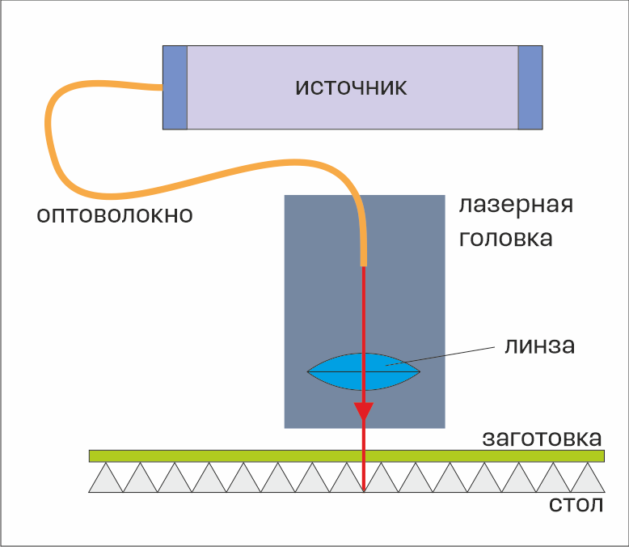

# ✨ Классификация машин лазерной резки

Можно выделить несколько способов разбиения машин лазерной резки на условные классы.

## По назначению

Разница в параметрах обработки металлов и неметаллов настолько значительна, что мало кто из современных производителей лазерных машин выпускает широкоуниверсальные машины, способные к эффективной обработке и металлов и, например, фанеры.   По назначению или по обрабатываемым материалам машины лазерной резки можно разделить на предназначенные для обработки металлических и неметаллических материалов.&#x20;

## По типу источника

В задачах лазерной резки широкое распространение получили газоразрядные (CO2) лазеры, твердотельные волоконные, а в последнее время еще и диодные лазеры. Тип источника определяет длину волны излучаемого света. Для CO2 лазеров характерной является длина волны 10,6 мкм, для иттербиевых волоконных лазеров – 1,06 мкм, наконец, лазерные диоды работают в видимом спектре — 450-460 нм. Помимо типа источника серьезнейшее значение имеет его мощность, например с помощью иттербиевого волоконного лазера мощностью 20 Вт можно за несколько проходов прорезать металлическую фольгу, а с помощью источника мощностью 2 кВт можно за единственный  проход прорезать металлический лист толщиной в 6 – 8 мм.

## По механизму перемещения лазерного пятна&#x20;

В машине лазерной резки возможно непосредственное перемещение лазерного источника относительно заготовки, при этом источник является частью рабочего органа — лазерной головки. В современных аппаратах такая схема применяется в установках с компактными и легкими диодными лазерами. На Фабрике доступен аппарат Ikier K1, утилизирующий данную схему и использующий головку с шестью объединенными в единую систему диодными лазерами.

<figure><figcaption>
Лазерный источник является частью подвижной головки. В процессе обработки головка перемещается в плоскости XY, а перед обработкой перемещается по оси Z для фокусировки луча на поверхности заготовки
</figcaption></figure>

Для машин с газоразрядным источником популярной является схема с "летающей оптикой" (flying optics) в которой источник недвижим относительно заготовки, а луч передается на подвижную лазерную головку с помощью системы перископических зеркал. Одно из двух подвижных зеркал находится непосредственно в лазерной головке, второе — закрепляется на балке оси X. Третье, а в некоторых системах еще и четвертое, зеркало в процессе лазерной резки не перемещаются. Такая схема позволяет максимально облегчить лазерную головку (что дает возможность перемещать ее с большими скоростями). На Фабрике по этой схеме работают CO2 лазерные машины GCC (4 зеркала) и Kamach[^1] (3 зеркала).&#x20;

<figure><figcaption>
Источник неподвижен, луч передается через систему зеркал. Зеркало 1 находится внутри головки и перемещается вместе с ней в плоскости XY, зеркало 2 — перемещается по оси Y, зеркало 3 — неподвижно. Перед обработкой по оси Z перемещается стол для фокусировки луча на поверхности заготовки
</figcaption></figure>

Альтернативным системе перископических зеркал способом передачи луча от источника к лазерной головке является оптическое волокно. Такая схема применяется на большинстве современных лазерах для резки металлов. На Фабрике по такой схеме работает металлообрабатывающий аппарат МЛ.

<figure><figcaption>
Неподвижный источник и подвижная головка, луч от источника к головке передается по оптоволокну
</figcaption></figure>

Наконец, при обработке относительно небольших площадей эффективной является схема с гальваническим сканатором. В такой схеме лазерная головка при обработке остается неподвижной относительно заготовки, а луч отклоняется подвижным зеркалом и сквозь объектив направляется на заготовку. Такая схема широко распространена в устройствах лазерной "маркировки", основным предназначением которых является формирование контрастного и рельефного изображения на поверхности деталей. Лишь ограничено такие устройства могут использоваться для резки тонких заготовок — металлических фольг. На фабрике по такой схеме работает устройство МиниМаркер.

<figure><figcaption>
Сканатор направляет луч в нужное место. Перед обработкой для фокуссировки по оси Z перемещается лазерная головка 
</figcaption></figure>

[^1]: 
